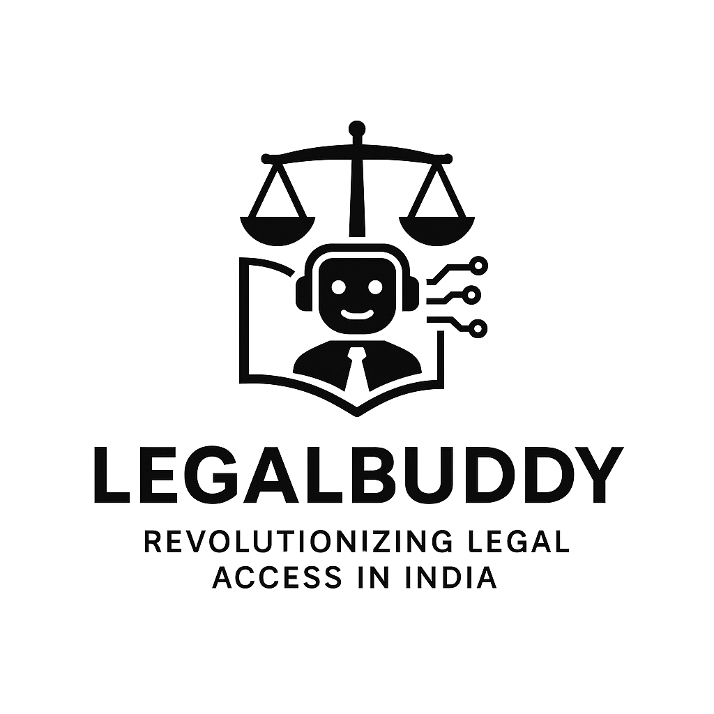

  

# ⚖️🚀 LegalBuddy 2025 – AI-Powered Legal Assistance Platform

---

## 📑 Table of Contents
- [🌟 Introduction](#🌟-introduction)
- [🎯 Problem Statement](#🎯-problem-statement)
- [💡 Solution](#💡-solution)
- [⭐ Product USP](#⭐-product-usp)
- [🔄 User Flow](#🔄-user-flow)
- [🎨 Design](#🎨-design)
- [🏗️ Technical Architecture](#🏗️-technical-architecture)
- [🛠️ Tech Stack](#🛠️-tech-stack)
- [💻 Technical Implementation Details](#💻-technical-implementation-details)
- [🚀 Deployment & Configuration](#🚀-deployment--configuration)
- [🎯 Key Competitors](#🎯-key-competitors)
- [📊 Market Size](#📊-market-size)
- [🚀 Go-To-Market Plan](#🚀-go-to-market-plan)
- [🎥 Demo](#🎥-demo)
- [📚 Project Documentation](#📚-project-documentation)
- [👥 Team](#👥-team)
- [🔮 Future Roadmap](#🔮-future-roadmap)
- [🤝 Contributing](#🤝-contributing)
- [📄 License](#📄-license)
- [📞 Connect With Us](#📞-connect-with-us)

---

## 🌟 Introduction
> **LegalBuddy 2025** is an innovative AI-powered legal assistance platform ⚖️ that revolutionizes how individuals and businesses access legal services. By leveraging cutting-edge AI technologies, we provide comprehensive legal support, from document analysis to lawyer matching, making legal services more accessible, efficient, and cost-effective.

---

## 🎯 Problem Statement
❌ High costs of legal services  
❌ Limited access to legal expertise  
❌ Time-consuming legal research  
❌ Complex document management  
❌ Inefficient lawyer-client matching  
❌ Lack of real-time legal assistance

---

## 💡 Solution
✨ AI-powered document analysis and summarization ⚖️  
✨ Real-time legal research and case law analysis 🏛️  
✨ Intelligent lawyer matching system 👩‍⚖️  
✨ Secure document management 📜  
✨ Video conferencing with transcription  
✨ Comprehensive legal support platform

---

## ⭐ Product USP
- 🤖 **AI-Powered Legal Assistance**: Advanced document analysis, real-time legal research, meeting transcription, intelligent lawyer matching
- 📄 **Comprehensive Document Management**: Secure storage, version control, collaboration tools, access control
- 💬 **Real-time Communication**: Video conferencing, chat system, file sharing, meeting recording
- 👨‍⚖️ **Intelligent Lawyer Matching**: AI-based matching algorithm, detailed profiles, review system, availability management
- ⚖️ **Legal Compliance & Security**: End-to-end encryption, role-based access, audit trails

---

## 🔄 User Flow

  

### Key User Journeys:

1. **Onboarding Process**
   - Registration
   - Profile Setup
   - Preferences Configuration
   - Plan Selection

2. **Subscription Tiers**
   - **Freemium**
     - Basic AI Q&A
     - Legal Quiz
     - Limited Document Storage
     - Basic Case Tracking
     - Standard Support
   
   - **Premium**
     - Advanced AI Q&A
     - Enhanced Quiz Features
     - Extended Storage
     - Advanced Tracking
     - Priority Support
     - Lawyer Chat & Video Consultation
   
   - **Enterprise**
     - All Premium Features
     - Team Management
     - API Access
     - Dedicated Support

3. **Lawyer Features**
   - Case Management
   - Client Communication
   - Meeting Scheduling
   - Analytics Dashboard
   - Tiered Feature Access

4. **Support System**
   - Ticket Management
   - User Support
   - Issue Resolution
   - Priority Handling

5. **Admin Controls**
   - Analytics Monitoring
   - User Management
   - Security & Compliance
   - API Integration
   - Subscription Management

### Security & Data Flow
- Authentication at every level
- Secure access controls
- Compliance monitoring
- Database layer separation
- Cross-tier security measures

---

## 🎨 Design

  🎨
  🖼️
  🧑‍💻
  ⚖️
  📜

**Design Principles:**
- 🎨 Clean and modern interface
- 🧭 Intuitive navigation
- 📱 Responsive design
- ♿ Accessibility compliance
- 🏷️ Brand consistency
- ⚖️ Legal theme throughout

---

## 🏗️ Technical Architecture

  🏛️
  🗄️
  🤖
  🔐

**Core Components:**
- 🖥️ **Frontend:** Next.js 14, TypeScript, Redux Toolkit, RTK Query, Tailwind CSS, Shadcn UI
- 🗄️ **Backend:** Node.js, Express.js, MongoDB, Mongoose, Socket.io
- 🤖 **AI Integration:** OpenAI API, Google Cloud Speech-to-Text, Google Cloud Text-to-Speech
- 🔐 **Authentication:** NextAuth.js, JWT, OAuth
- ⚖️ **Legal Compliance:** Secure storage, audit trails, access control

---

## 🛠️ Tech Stack
**Frontend:**
- ⚛️ Next.js 14
- 🟦 TypeScript
- 🛠️ Redux Toolkit
- 🔗 RTK Query
- 🎨 Tailwind CSS
- 🧩 Shadcn UI
- 🔌 Socket.io Client

**Backend:**
- 🟩 Node.js
- 🚦 Express.js
- 🍃 MongoDB
- 🧬 Mongoose
- 🔌 Socket.io
- 🤖 OpenAI API
- ☁️ Google Cloud Services

**DevOps:**
- 🐳 Docker
- 🛡️ GitHub Actions
- ☁️ AWS/Azure
- 🔄 CI/CD Pipeline

---

## 💻 Technical Implementation Details
*See code snippets and explanations for authentication, real-time communication, AI integration, database schema, API endpoints, state management, video conferencing, security, file storage, error handling, performance optimization, and testing above.*

---

## 🚀 Deployment & Configuration
*See detailed steps and code for environment setup, Docker, deployment, CI/CD, monitoring, backup, and security above.*

---

## 🎯 Key Competitors
1. 🏛️ **Traditional Legal Platforms**
   - Limited AI integration
   - Higher costs
   - Less automation
2. 🧑‍💻 **Basic Legal Tech Solutions**
   - Limited features
   - Poor user experience
   - Lack of integration
3. 🏆 **Our Advantage**
   - Comprehensive AI integration
   - Modern tech stack
   - User-centric design
   - Cost-effective solutions
   - ⚖️ Legal compliance focus

---

## 📊 Market Size
- 🌍 Global Legal Tech Market: $25.17B (2023)
- 📈 Expected CAGR: 12.3% (2023-2030)
- 🎯 Target Market Segments:
  - Individual users
  - Small businesses
  - Legal professionals
  - Law firms
  - ⚖️ Legal institutions

---

## 🚀 Go-To-Market Plan
1. 🚦 **Phase 1: Launch**
   - Beta testing
   - Early adopter program
   - Community building
2. 📢 **Phase 2: Growth**
   - Marketing campaigns
   - Partnership development
   - Feature expansion
3. 🌐 **Phase 3: Scale**
   - Enterprise solutions
   - International expansion
   - Advanced features
   - ⚖️ Legal partnerships

---

## 🎥 Demo

**Demo Features:**
1. 📝 User Registration
2. 📄 Document Analysis
3. 👨‍⚖️ Lawyer Matching
4. 🎥 Video Conferencing
5. 📂 Case Management
6. ⚖️ Legal compliance features

---

## 📚 Project Documentation
- 📖 [Technical Documentation](docs/technical.md)
- 📑 [API Documentation](docs/api.md)
- 🧑‍💻 [User Guide](docs/user-guide.md)
- 🚀 [Deployment Guide](docs/deployment.md)
- ⚖️ [Legal Compliance Docs](docs/legal-compliance.md)

---

## 👥 Team

  👨‍💻
  🧑‍💻
  ⚖️

**Core Team Members:**
- 👨‍💻 [Akash Kumar Singh – Frontend Developer](https://linkedin.com/in/akash-kumar-singh-883377273)
- 🧑‍💻 [Shahshi Sharma – Backend Developer](#)

---

## 🔮 Future Roadmap
**Short-term (6 months):**
- 📱 Mobile App Development (iOS/Android, Push notifications, Offline mode)
- 🌐 Multi-language Support (10+ languages, Localized content, Regional frameworks)
- 📊 Advanced Analytics (User tracking, Metrics, Custom reports)
- 🤖 Enhanced AI Features (Improved analysis, Research, Matching)
- ⚖️ Legal compliance automation

**Medium-term (1 year):**
- ⛓️ Blockchain Integration (Smart contracts, Verification, Secure transactions)
- 📝 AI Document Generation (Templates, Automated contracts, Custom builder)
- 🏛️ Virtual Courtroom (Online hearings, Digital evidence, Court integration)
- 🔒 Advanced Security (Biometrics, Encryption, Compliance)
- ⚖️ Regulatory reporting

**Long-term (2 years):**
- 🌍 International Expansion (Global presence, Partnerships, Compliance)
- 🧠 Advanced AI (Predictive analytics, Automated case management, Research)
- 🏢 Enterprise Solutions (Custom integrations, White-label, API marketplace)
- 🧩 Legal Tech Ecosystem (Third-party integrations, Developer platform, Marketplace)
- ⚖️ Legal research API

**Innovation Pipeline:**
- ⚛️ Quantum Computing Integration
- 🧭 AI Ethics Framework
- 🌱 Sustainable Legal Tech
- 🧑‍🤝‍🧑 Community-driven Features
- ⚖️ Legal innovation labs

---

## 🤝 Contributing
We welcome contributions! Please see our [Contributing Guidelines](CONTRIBUTING.md) for details.

---

## 📄 License

  📝
  ⚖️

© 2025 Akash Kumar Singh & Shahshi Sharma. All rights reserved.

This project and all its contents are protected by copyright law. You are **not free to use, copy, modify, or distribute** any part of this software or its assets without explicit written permission from the authors. For licensing inquiries, please contact the maintainers directly.

---

## 📞 Connect With Us

  
  
  

 
